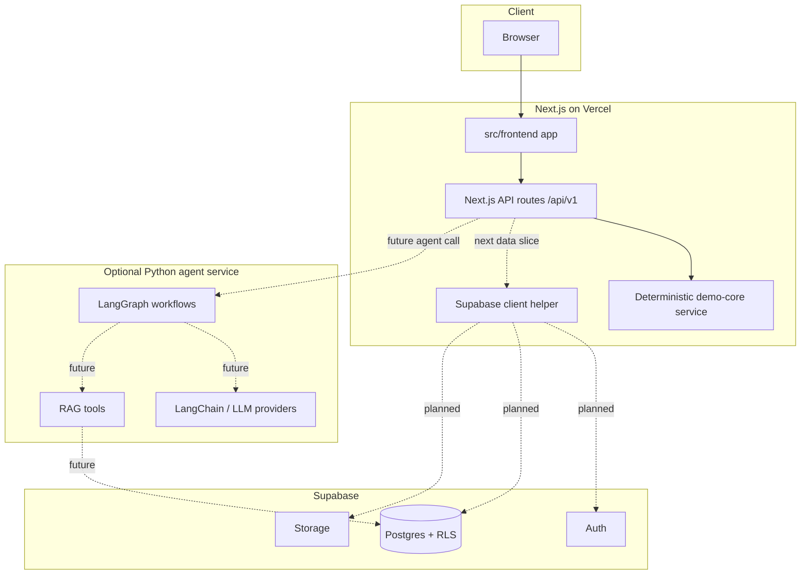

# Architecture

## System Overview

The current product demo is a Next.js application under `src/frontend`. The UI and product-facing demo API routes run in the same Next.js app so the Vercel deployment can serve the prototype without calling the Python backend.

Supabase is the intended source of truth for auth, organization-scoped data, RLS, and storage. The current route handlers use deterministic demo logic in `src/frontend/lib/demo-core.ts` until the Supabase-backed F01/F02 slices are implemented.

The Python code under `src/backend` remains the LangGraph/LangChain agent skeleton for future tutor, recommender, grader, and analytics workflows. It is not in the active UI request path yet.

## Architecture Diagram

## Components

### Frontend

- Location: `src/frontend`
- Framework: Next.js App Router
- Deployment target: Vercel
- Current UI surfaces: onboarding assessment, learning path, lesson player, AI tutor, progress view, manager dashboard

### Next.js API

Next.js route handlers own the current product-facing API contract:

- `POST /api/v1/chat`
- `GET /api/v1/core/capabilities`
- `POST /api/v1/core/assessment`
- `POST /api/v1/core/learning-path`
- `POST /api/v1/core/progress`
- `POST /api/v1/core/manager`
- `GET /api/v1/core/knowledge`

### Supabase

Supabase is the primary data/auth/storage layer for the product roadmap. Current frontend code includes a guarded Supabase browser client helper in `src/frontend/lib/supabase.ts`; route handlers will switch from deterministic demo logic to tenant-scoped Supabase reads/writes as F01/F02 land.

### Python Agent Service

`src/backend` contains the optional LangGraph/LangChain backend skeleton. It should be treated as an agent service boundary, not the default UI API path.

## Data Flow

1. User opens the Vercel-hosted Next.js app.
2. Client components call same-origin `/api/v1/*` route handlers.
3. Route handlers return deterministic demo results from `demo-core` today.
4. Future slices replace demo reads/writes with Supabase-backed tenant data.
5. Future AI-heavy flows can call `src/backend` agent services explicitly.

## Security

- Public Supabase access uses `NEXT_PUBLIC_SUPABASE_URL` and `NEXT_PUBLIC_SUPABASE_ANON_KEY`.
- Tenant safety must be enforced with Supabase RLS before real organization data is used.
- Server-only secrets stay in Vercel or local `.env` files, never in browser-exposed variables.
- Agent/LLM flows should remain behind server route handlers and must not run directly in client components.

## Design Decisions

| Decision | Choice | Reason |
|----------|--------|--------|
| Primary UI runtime | Next.js on Vercel | Simplest path for UI, route handlers, previews, and production deploy |
| Data/auth layer | Supabase | Managed Postgres, auth, storage, RLS, and tenant isolation |
| Current demo API | Next.js route handlers | Keeps the UI runnable without Python backend coupling |
| Agent boundary | `src/backend` LangGraph service | Preserves room for tutor/recommender/grader workflows when needed |
| Default mode | Deterministic demo logic | Works during hackathon setup without secrets |
