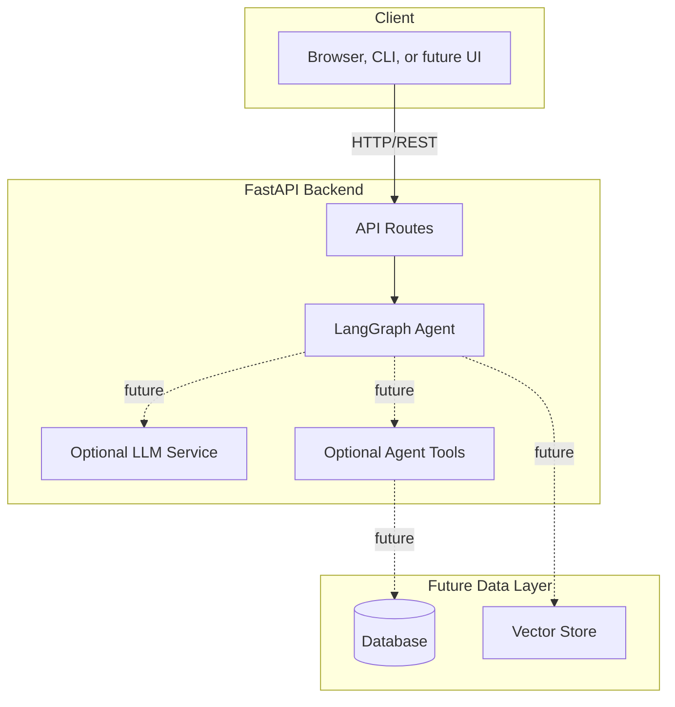
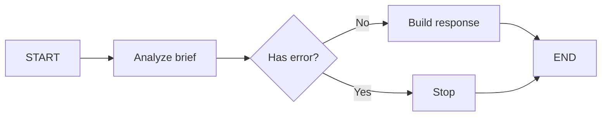

# Architecture

## System Overview

Codex Hackathon Agent is a small FastAPI service around a LangGraph workflow. The current graph is deterministic so the prototype can run during development without external API keys, while leaving clear extension points for LLM calls, tools, data stores, and a frontend.

## Architecture Diagram

## Components

### Client

The first client can be Swagger UI, curl, or a later frontend. The backend contract is stable enough to build UI against `/api/v1/chat`.

### Backend

FastAPI owns request validation, CORS, health checks, and route composition.

### Agent

- Agent type: lightweight planning workflow
- State: `query`, `context`, `intent`, `analysis`, `response`, `action_items`, `error`
- Nodes: `analyze`, `respond`
- Tools: calculator and placeholder knowledge-search tools are available for future graph expansion

### Database

No database is required for the current prototype. `DATABASE_URL` defaults to SQLite so persistence can be added without reshaping config.

### LLM Service

`src/services/llm.py` creates a ChatOpenAI client only when `OPENAI_API_KEY` is configured. This keeps local tests and demos predictable.

## Data Flow

1. Client sends a product brief to `/api/v1/chat`.
2. FastAPI validates `ChatRequest`.
3. LangGraph detects intent and builds a response/action plan.
4. API returns `ChatResponse` with `response`, `intent`, `action_items`, and `analysis`.

## Security

- API keys stay in `.env`, which is ignored by git.
- Pydantic validates request payloads.
- CORS origins are controlled through `CORS_ORIGINS`.
- LLM-backed features fail fast when the API key is missing.

## Design Decisions

| Decision | Choice | Reason |
|----------|--------|--------|
| Framework | FastAPI | Async, auto-docs, type-safe |
| Agent | LangGraph | Explicit state and node boundaries |
| Default mode | Deterministic | Works during hackathon setup without secrets |
| Database | None yet | Keep the first demo loop small |
