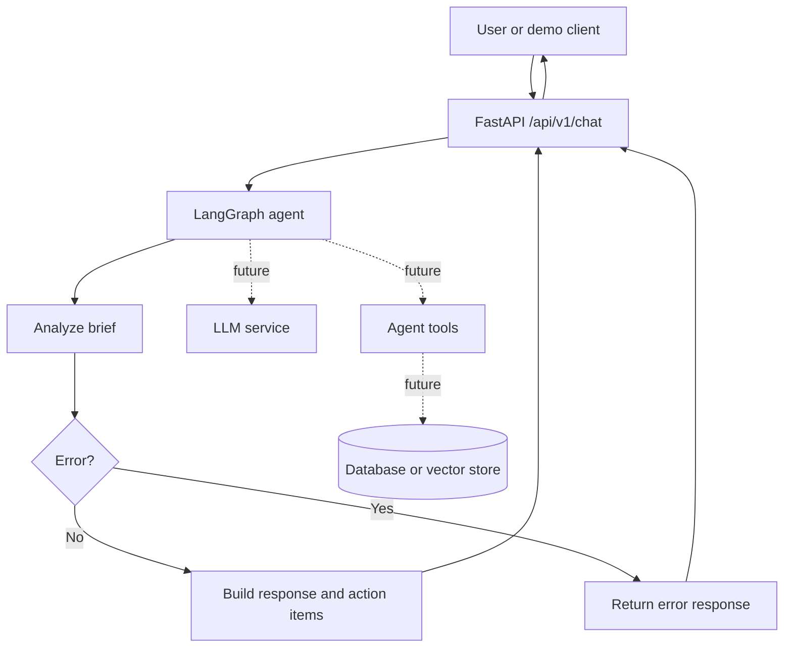

# Architecture Diagram

```mermaid
flowchart TD
    U[User or demo client] --> API[FastAPI /api/v1/chat]
    API --> G[LangGraph agent]
    G --> A[Analyze brief]
    A --> D{Error?}
    D -->|No| R[Build response and action items]
    D -->|Yes| E[Return error response]
    R --> API
    E --> API
    API --> U

    G -. future .-> LLM[LLM service]
    G -. future .-> Tools[Agent tools]
    Tools -. future .-> Data[(Database or vector store)]
```
