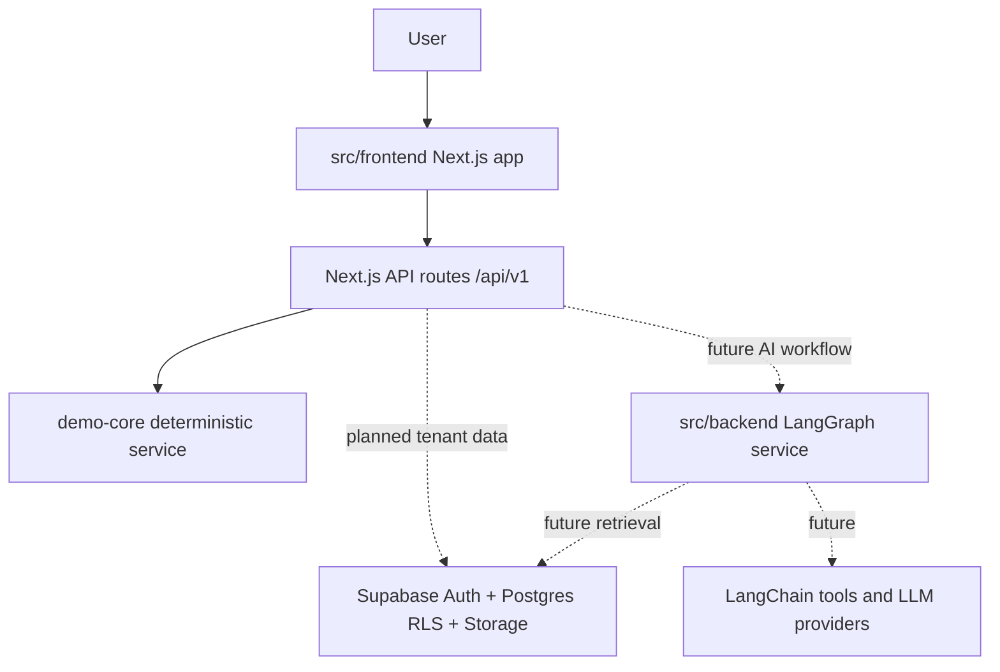

# Architecture Diagram

```mermaid
flowchart TD
    U[User] --> FE[src/frontend Next.js app]
    FE --> API[Next.js API routes /api/v1]
    API --> Demo[demo-core deterministic service]
    API -. planned tenant data .-> SB[Supabase Auth + Postgres RLS + Storage]
    API -. future AI workflow .-> Agent[src/backend LangGraph service]
    Agent -. future .-> LC[LangChain tools and LLM providers]
    Agent -. future retrieval .-> SB
```
